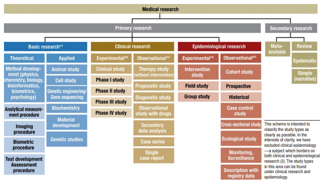
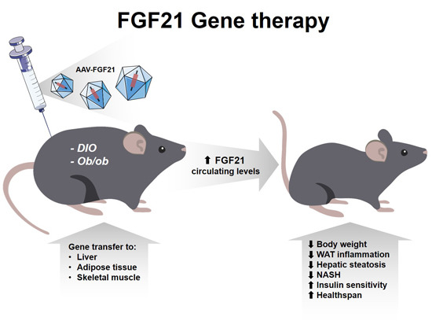
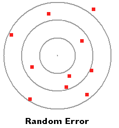
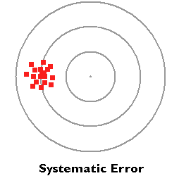
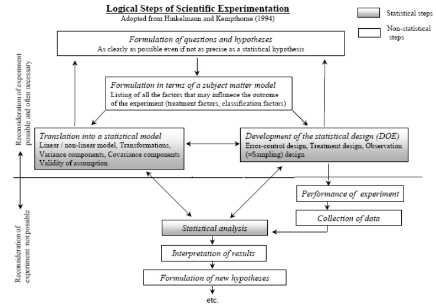
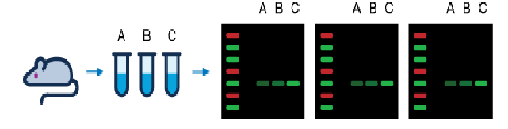
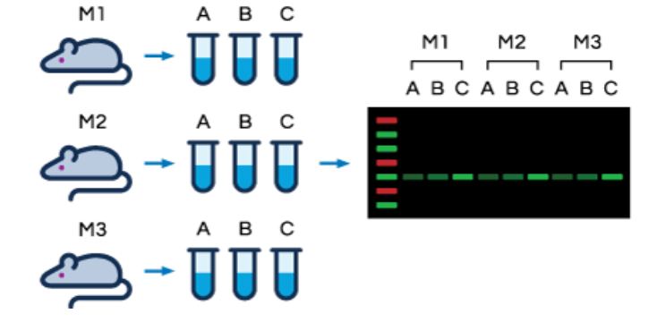
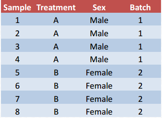
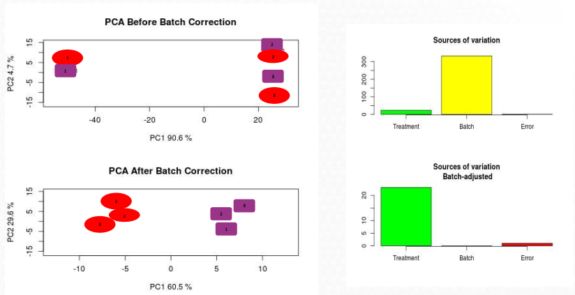
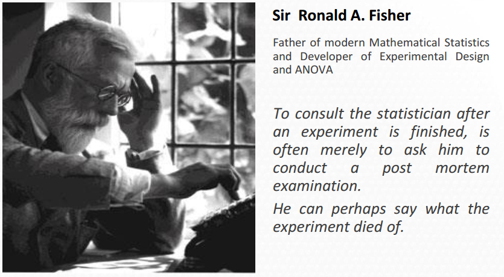

```{r setup, include=FALSE}
knitr::opts_chunk$set(echo = FALSE)
options(htmltools.dir.version = FALSE)                      
```

# Outline

.columnwide[

### 1) [Experiments: What, why, how](#Introduction)

### 2) [Principles of experimental design](#Principles)

### 3) [Basic types of experimental designs](#TypesDesenyos)

### 4) [Some resources](#Resources)

]

---

class: inverse, middle, center

name: Introduction

# Experiments: What, Why, How

---


# Types of studies in medical research

.center[
 
]

source: Dtsch Arztebl Int 2009; 106(15): 262-8. 

DOI: https://doi.org/10.3238/arztebl.2009.0262 

---

# Experimental Studies

- Investigate changes in response variable,
- by manipulating the levels of one or more treatment or independent variables.

- Investigators play active role by (randomly) assigning each individual to each group.

.center[
 
]

---
# Observational Studies

- Investigate changes in response variable,
- due to different levels of an independent variable,

- Assignment of subjects into each other group is outside the control of the investigator who can only observe the response variable in each group.

.center[

]


---
# Why experiment?

- A very common type of research study is _experimental studies_.

- The purposes of the experimental studies are diverse. For example, we could propose experiments to:

1. Compare responses to different treatments.
2. Determine the cause (s) of the response variation.
3. Find the conditions in which the optimal response is reached,
4. Develop a model to predict responses.
  
- A characteristic of experimental versus observational studies is that, under the right conditions, the former are the only ones that allow establishing causal relationships.
    
---
# An example and basic ideas

.pull-left[

- Goal: investigate the effect of a drug to prevent the development of diabetes in genetically modified mice.
- Effect will be tested and compared with that of administering a placebo.
- Effectiveness of the treatment may be affected by the age of the animal, so it is applied to mice "young" or "old"
- Mice randomly selected within each age group will receive either the drug or a placebo (administered in the same way as the drug).
- To determine the effect of each drug/age combination, weight, and decrease in age-related insulin resistance will be determined.
]

.pull-right[

<br><br><br>

.center[
 
]

Source: EMBO Mol Med (2018) 10:e8791 

https://doi.org/10.15252/emmm.201708791
]

---

# Some definitions

- An __experiment__ is any investigation in which a particular set of conditions is applied to and the results of said experiment are observed and evaluated. app. _For example, study of the drug in pre-diabetic mice_

- Each group of experimental conditions is a __treatment__ or __factor__. For example "Drug" and "Age" are two factors.

- Each particular condition within a factor is a __level__ of that factor. For example Drug/Placebo or Old/Young are two factors with two levels each.

- The results that we observe after applying a treatment are the __responses__.


---

# Some important definitions:

- __Experimental Unit (UE) __ The physical entity or subject exposed to the treatment independently of other units.
- Each mouse is an experimental unit
  
- __Unit of observation (UO) __ The unit in which they are carried out.
observations, that is, measurements.
- It can be a sample of the EU or be identical to the EU.
  
- __Experimental error__: random variation observed between different repetitions carried out, or not, under the same experimental conditions.

- __ Observation error__: The variation between multiple observations of the same
experimental unit.

---

# Types of variability

.pull-left[
- _Random variability_ 
- Differences expected to be observed when different subjects from the same sample are measured.
- It is usually always present to a greater or lesser degree.
- It is usually reduced by increasing the sample size

- _Systematic variability_
- Differences between subjects or observations attributable to the measurement process or to a non-random selection of all the individuals in the sample.
- Usually can be corrected
]

.pull-right[

 

 

]


---
# What characterizes an experiment?

<br>
1. The treatments to be used

2. The experimental units to be used

3. The way treatment levels are assigned to the experimental units, that is, _the experimental design_

4. Responses that are measured

---

# What characterizes a good experimental design?


- It __avoids biases__ or systematic errors

- It __allows a precise estimation of the response__, which implies that the random error is as low as possible.

- It __allows an adequate estimation of the error__.

- It __has wide validity__: the experimental units are a sample of the population in question, so it is possible to extrapolate the conclusions of the sample to the population.

---

# How to get a good design

<br>

- Try to apply some ideas, basic and somewhat redundant, but which, together, guarantee a good result.

1. Rely on a _checklist_ of the experimental design.

2. Apply _the scientific method in the appropriate study_.

3. Be based on the basic principles of Experimental Design

  - Randomization, 
  - Replication, 
  - Local control.

- And also
  - Plan design and analysis at the same time,
  - Involve your favorite statistician from the beginning (or before) of the experiment.

---

# Design checklist

1. Define the objectives of the experiment.
2. Identify all possible sources of variation.
3. Select an appropriate experimental design.
4. Specify the experimental process
5. Conduct a pilot study
6. Specify the hypothesized model
7. Describe the tests to be performed.
8. Estimate the required sample size using the results.
of the pilot study
9. Review your decisions in Steps 1 through 8 and make the
necessary revisions.

---
# Design, experimentation and analysis

.center[
 
]

---

class: inverse, middle, center

name: Principles

# Principles of experimental design

---

# Basic principles of experimental design

- Good experimental designs share common traits.

  - Apart from the fact that they are based on the logic of experimentation and the scientific method, 
  - they usually rely on some ideas, whose application guarantees good designs, or, in any case, better designs than those studies in which they are not taken into account explicitly. 

- Some of these principles are:

  - Randomization 

  - Replication

  - Local control or blocking


---

# 1. Randomization

- Since it is not possible to avoid random variations, we can randomly assign treatments to units to try to compensate for the effect of such variation.

- This can be done
  - Randomly assigning individuals to treatments and/or
  - Running the experiments in random order.
  
- **Randomizing does not mean doing everything at random**. 

- Randomization is also important to ensure the validity of statistical procedures.

- Randomization helps preventing a _preferential assignment_ of certain to certain experimental units.
  - For example, a doctor may be "tempted" to give the drug she thinks works best to patients with the worst prognosis.

---

# 2. Replication

- There is general agreement on the need to apply each treatment independently to several experimental units.

- This ... 
  - Helps to establish the reproducibility of the results.
  - Protects against eventual abnormal or unusual results.
  - Provides a way to estimate the variance of the experimental error in the absence of systematic differences between the experimental units.
  - Provides the ability to increase the precision of estimates of means of treatment.

- Replication is importanty but, _it does not necessarily guarantee valid estimates of experimental error_ or, what is more:

- Having the appropriate sample size **does not guarantee the presence of an effect**: The -often heard sentence- _"we didn't detect any effect but if we can collect enough samples the effect will be seen"_ can be considered a _Statistical Myth_.
  
---

# Replicates, power and precision

- The number of repetitions $r$ is directly related to the precision of the experiment
- Variability is inversely related with the precision of the experiment.
$$
1/var (\overline{X}) = r/\sigma ^ 2 \quad (*)
$$
- While this is stated for estimating the sample mean, the rule can be easily extended to other characterristics.

- From (*) it follows that:
    - the greater the number of replicatess, $r$,
    - and the lower the variability, $\sigma^2$,
    - the greater the precision a design provides.

- From this relation, it is straightforward to derive formulae for the sample size needed for estimation.

---

# How many replicates are needed?

- If the goal of an experiment is, not only estimating one characteristic, but also comparing groups, that is _detecting the effect of a treatment_,  this can also be accounted for.

- Given the relation between:
  - (1) The variability
  - (2) The desired effect size,
  - (3) The level of significance ("alpha", type I error) of the test,
  - (4) The power (1-"beta", type II error) wished to attain

  - One can compute the sample size needed given the previous four values or, 
  - One can fix any four and compute the other one (for instance the power given a sample size, etc.)

- Sample size online calculator example: [granmo] (https://www.imim.es/ofertadeserveis/software-public/granmo/)

---

# Technical and biological replicates

.pull-left[

<p>
<p>
 
for
<small>
Technical replications allow quantifying variability associated with the technique used.
</small>
]

.pull-right[
 
for
<small>
Biological replications allow quantifying the variability associated with the study population.
</small>
]

- The total variability can be decomposed into various _components of the variance_.

$$
\sigma (TOTAL)^2 = \sigma(TEC)^2 + \sigma(BIO) ^ 2 + \sigma (ERR) ^ 2
$$
- _In general_ : 

$$ \sigma (TEC) ^ 2 < \sigma (BIO) ^ 2 $$
- source: https://www.licor.com/bio/blog/technical-and-biological-replicates


---

# Replicates or _pools_?

- Sometimes it may be decided to combine mRNA from different samples to form a "pooled sample" or _pool_

- This can be done because ...
  - Each separate sample does not provide enough mRNA
  - You want to compensate for excess variability by "averaging" similar samples.

- This can be misleading, but correct if done apprpriately:
  - Combining several samples in each group but ...
  - Using several groups of different samples

- What not to do:
  - Don't use groups when individual information is important (e.g. paired designs).
  - A sample with 3 grouped individuals is not the same as 3 individual samples!
    
---

# 3. Local control

- In many situations it is common for not all samples to be homogeneous.
- For example, in an experiment to compare two treatments using expression microarrays, there may be different types of subjects:
  - Male or female animals
  - Animals from several litters (those from the same litter look more like each other)
  - Samples processed in different days due to the capacity of the equipment
  - and other sources of known but unavoidable variability.
    
- If there are systematic differences between groups of samples ("blocks") the effects of interest (for example the effect of a treatment) can be  affected by differences between samples of different blocks,

- In other words, it may not be clear if the differences observed are attributable to the effect of the treatment or other factors that we call _confounding_.

- Local control or blocking, that is _distributing each treatment evenly among the different blocks_ is the way to minimize this undesired effect.

---

# How to apply local control

.pull-left[

 

<p>

- This design does not apply good local control.

- Treatment effect can be confused with 

  - the effect of age or 
  - that of the production batch.

]

.pull-right[

 
<p>

- This design applies good local control.

- The possible effect of sex or of the production batch is distributed among the different levels of treatment, which will allow them to be analyzed separately.

]

---

# Batch effect and its adjustment 

.center[ 
 
] 
 
- A Principal Component Analysis (PCA) can reveal the presence of undetected blocks in the design.
 
  - If the different levels of the "batch" are distributed among the treatment levels, it is possible to correct them. 
 
  - If there is confusion between the two (for example, each treatment has been done in a distinct batch), the effects cannot be separated.

---

class: inverse, middle, center

name: Layout Types

# Basic types of experimental designs

---

# Experimental designs

- A key point in any experiment is the way in which
_the experimental units are assigned to the treatments_.

- This assignment must be done in such a way that:
  
  - it is possible to estimate the effects that interest the researcher
  
  - the random variability is as small as possible ("maximum precision") with the available resources.
  
  - the best possible local control is achieved, given the circumstances of the experiment.

- To achieve the best possible design, we will take into account the components that define each design.

---

# Design components

When considering the choice of a design for an experiment we must take into account:

- The **design of the treatments**.
  - Which and how many treatments are included in the study?
  - Are they considered separately or in combination?
  - What are the levels of each treatment?

- The **error control design**.
  - How are treatments assigned to experimental units ?. <br> 
This depends on the resources, the available units, the desired precision, the heterogeneity between UEs.

- The **Observational Design**
  - At what level are the observations made?
<br> Is each EU an OU or are there several OUs per EU (subsampling)?
  
---

# From components to design
<small>
```{r echo = FALSE, message=FALSE}
library (dplyr)
t <- data.frame (5,4)

t [1,1] <- "Treatments Design "
t [1,2] <- "Error control D."
t [1,3] <- "Observational Design"
t [1,4] <- "Design"

t [2,1] <- "1 factor, (k niv.), r replicates/level"
t [2,2] <- "Assign trat. 1 ... k  UE"
t [2,3] <- "1 UU = 1 UO"
t [, 4] <- "Completely Randomized"

t [3,1] <- "1 factor (k level), 1 block (l level), k * l EU"
t [3,2] <- "Assign trats. 1 ... k to EU, in each block"
t [3,3] <- "1 EU = 1 OU"
t [3,4] <- "Completely randomized block design"

t [4,1] <- "2 factors (k, l levels.), r replicates of each combination"
t [4,2] <- "Assign each combination 1 ... k * l of treatments to EU"
t [4,3] <- "1 EU = 1 OU"
t [4,4] <- "Two-factor design with interaction"

t [5,1] <- "1 Trat. (k niv), l repeated measures, r replicates/combination "
t [5,2] <- "Assign trats. 1 ... k to individuals at time 1"
t [5,3] <- "For each UE there are 'l' OU (temporal measurements)"
t [5,4] <- "Repeated Measures Design"

colnames (t) <- t [1,]
t <- t [-1,]
rownames (t) <- t [, 4]
t <- t [, - 4]
knitr :: kable (t, "html")%>% kableExtra :: kable_styling ()
```
</small>
---
# Designs, Models and Analysis

- The design of the treatments and the observational design help us to choose the appropriate design for an experiment.
- Each design can be represented by a _linear model_. This model:
  - Represents the relationships between responses, treatments and experimental and observational units.
  - Is the basis for the analysis of the data once it has been collected.

- Error control design defines how the randomization is carried out, that is, the assignment of individuals to the treatments.
  - This should be done when _planning the investigation_.

---

# Experimental design and ANOVA

- Sometimes the design of the experiment is confused with its analysis, which is carried out using Analysis of the Variance techniques.

  - This is understandable, because when one defines the experimental design the way it will be analyzed is set. That is _they are related, but they are not the same_.
  - It is a common problem, in some books or statistics courses, which do not pay attention to how treatments were allocated between individuals and provide  the data already collected. 
    - This makes it difficult for students to realize that experimental design had been carried out before the data were collected.


- Summarizing: Although the treatment design suggests a certain analysis model _the experimental design should not be confused with the analysis of the data collected in the experiment!_

---

# Experimental design and ANOVA

```{r}
d <- t
colnames (d) [3] <- "Analysis"
d [1,3] <- "1-way ANOVA"
d [2,3] <- "2-way ANOVA without interaction"
d [3,3] <- "3-way ANOVA with interaction"
d [4,3] <- "ANOVA of repeated measures"
kableExtra :: kable (d, "html")

```

---
# Completely randomized design

- Gene therapy experiment: compare four techniques to correct faulty genes

- A: Normal gene inserted in a nonspecific location.
- B: Abnormal gene exchanged for a normal gene.
- C: Abnormal gene repaired by selective reversion mutation.
- D: Regulation of a particular altered gene.

- 20 genetically identical and modified mice, affected by the disease to be treated, are selected.

- Treatments are randomized between the mice.

- The response variable is _gene expression_.

---

# Completely randomized design

- The simplest design, suitable for comparing several treatments on a homogeneous sample.

- Randomization is performed by randomly assigning each of the 1 .... k treatments to individuals out of a total of N = k * r

- The basic linear model for one-factor experiments is as follows:
$$
Y\_{ij}=\mu\_i+e\_{ij}=\mu+\tau\_i+e\_{ij}, \quad i=1\dots k,\quad j=1\dots r.
$$
- The analysis will usually be carried out by means of a one-way analysis of variance (ANOVA).

---

# Randomization in a DCA

- There are many libraries that allow randomization, but it can also be done easily with a small script.

- Randomization is carried out _before_ the experiment and it only indicates which treatment will receive each experimental unit
- Once the experiment is carried out, it is usual to present the data ordered by the treatments received, which _eliminates the evidence_ that the assignment has been made randomly.

.center[ 
 
] 

---

# Random block design

- After exposure to a poison, cells can be treated by different substances that accelerate regeneration.

- A study wants to compare six of these growth factors (5 are treatments and 1 is a control).

- A problem has caused that there is not enough culture medium to grow all treatments with replicates. Instead, there are 4 culture media available.

- Since a complete randomization is not possible, it is decided to _block by type of culture medium_.

  - We prepare 4 groups of 6 plates, each group of a type of culture
  - Within each group a different treatment is randomly assigned to each of the six plates.

---

# Random block design

- The completely randomized design loses utility if the experimental material is not homogeneous.

- In these cases, we can apply local control (blocking) and divide the experimental material in homogeneous subgroups, which we will call blocks.

- Once the samples have been distributed among the blocks, the treatments are applied to the experimental units randomly and independently of the other blocks.

- This design is called _Random Block Design (RBD)_.

- The linear model that describes the experiment is the following:
$$
Y\_{ij}=\mu+\rho\_i+\tau\_j+e\_{ij}, i=1\dots k, \, j=1\dots l.
$$
- The analysis will usually be carried out by means of an analysis of variance (ANOVA) of two factors without interaction.
- Obviously, if it is not possible to distribute the samples evenly between the blocks, the situation becomes complicated and we are faced with _unbalanced designs_

---

# Block or randomize?

- _Block what you can and randomize what you cannot - Box, Hunter & Hunter (1978)_

- Randomization provides a rough balance between variables that have not been taken into account.

- Local control eliminates the effect of differences between blocks, thereby ensuring that differences between treatments cannot be due to differences between blocks.

---

# Factorial design

- A study was conducted to study the effect of a drug and a diet on systolic blood pressure.

- 20 people with high blood pressure were randomized to one of four treatment conditions.

  - Control group (neither diet nor drug modification)
  - Diet modification only
  - Drug only
  - Modification of both drugs and diet

- At the end of the treatment period, systolic blood pressure was assessed.

- It is a factorial design in which each of the two treatments (drug, diet) can be randomly assigned to each individual.

- By having 20 individuals, there can be replicates of each treatment combination.

---

# Factorial design

- This design is useful to study the effects of several factors simultaneously.

- The "treatments" are _all combinations of the different factors_ under study.

- Randomization is similar to the completely randomized design, that is, each combination of treatments is randomly assigned to independent _r_ EUs.

- The fact that each combination is replicated makes it possible to study, not only the effects of each factor separately, but also the interaction between them.

- The linear model that describes a two-factor design with interaction with _t_ and _s_ levels and _r_ replicates respectively is the following:

$$
Y\_{ijk}=\mu+\rho\_i+\tau\_j+\tau\rho\_{ij}+e\_{ijk},\, i=1\dots t,\, j= 1\dots l, \, k=1\dots r.
$$

- The analysis will usually be carried out by means of an analysis of variance (ANOVA) of two factors with interaction.

---

# Repeated measures design

- A study wanted to measure the concentration of certain metabolites in plasma after two dietary interventions consisting of adding an amount of olive oil or an equivalent amount of walnuts to the standard diet.

- 21 mice subjected to the same diet were taken and an intervention (water, olive oil or nuts) was randomly assigned.

- The concentration of the metabolite in blood was measured after before the intervention and at 24h, 48h and one week.

---

# Repeated measures design

- When we take more than one measurement in each experimental unit, we have a _within-subjects design_.
- In this case, the data have different characteristics from the previous ones.

  - The measurements taken on the same individual are correlated.
  - There is a new source of variation that must be taken into account: variability _within_ subjects.
  
- Apart from this, they offer the same possibilities as with other designs, but with an additional source of variability, "time".

- The analysis of repeated measures data is a whole world. Although the _ANOVA of repeated measures_ is traditionally used, the current trend is to perform the analyzes using _linear mixed models_ which are much more flexible.

---

# Summarizing ...

- A good experimental design is essential to carry out good experiments.

- Experimental design means _planning in advance_, that is, before and not after the experiment.

- The experimental design must consider all steps: from sampling to data analysis.

- Applying grounded principles such as _randomization_, _replication_ and _local control_ is key to obtain good experimental designs.

- The analysis of designed experiments is carried out with the Analysis of the Variance (ANOVA). While each design can be asociated with an ANOVA model they should not be confused.

- Whenever possible we should have statistical support _from the beginning of the study_

---

# And, as the master said ...

.center[
 
]

---

class: inverse, middle, center

name: Resources

# References and resources

---

# References and resources

- [3rs-reduction.co.uk](http://www.3rs-reduction.co.uk/html/main_menu.html)

  - A short and interactive introductory course on the design of experiments focused on the benefits derived from an adequate design for the reduction of suffering in experimental animals.
  
  - The "Statistical Analysis" section takes a brief tour of some experimental design models and their analysis.
    
- [A First Course in Design and Analysis of Experiments] (http://users.stat.umn.edu/~gary/Book.html)
  
  - A book for an introductory course to design of experiments that, after being sold out in bookstores, the author decided to provide freely on the internet.
    
  - It takes a "traditional" approach to the subject and contains aspects that today would be approached differently, but it continues to be very interesting.
    
  - The author updated the examples by implementing them in R.
  
   
